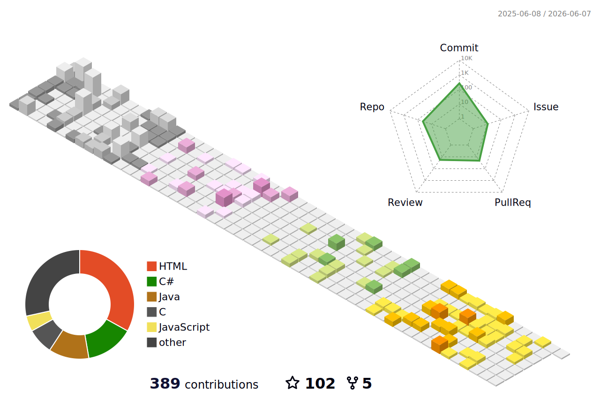

<h1 align="center">Nguyễn Duy Khánh</h1>

  🎓 Software Engineering Student &nbsp;|&nbsp; 💻 Aspiring Developer &nbsp;|&nbsp; 📚 Lifelong Learner

  
  
  
  

---
## 🧑‍💻 About Me

- Currently pursuing a degree in **Software Engineering** at **FPT University 🇻🇳**
- Passionate about building **efficient**, **maintainable** software solutions
- Love to create interactive projects with **Unity + C#** and **RBX Engine**
- Organized & productive using **Notion** for knowledge and project management

---
## 🏆 Achievements & Leadership  
- **Founder – Tech U Minh Club** (2023 - 2024)
  - Founded and led a student-driven technology community with 50+ active members.
  - Organized monthly algorithm and programming contests to strengthen the skills of the local competitive programming team.
  - Took the initiative to design and lead training programs for the local informatics team.
- **50% Tuition Scholarship** – FPT University Admission (2024)
- **President** – FCoder Club (FPT University Cần Thơ) (2025 – present)
  - Led the university’s premier coding club, coordinating training, events, and competitions
  - Fostered collaboration among 100+ student programmers and maintained contest preparation pipelines
- **Problemsetter & Team Lead** – FCoder Club (2024 – present)
  - Designed and reviewed algorithmic challenges for contests with 20+ participants
  - Coordinated with judges & tech teams to ensure fairness and technical accuracy
- **Top 5** – FALGO25 (FPT University Cần Thơ, 2025) – Campus-level algorithm contest selecting top talents for the ACM/ICPC team.
- **Top 60** – ICPC Southern Provincial Contest (2025)
- **Honorable Mention** – National Olympiad in Informatics for Students (Advanced Track) (2025)
  - _National-level competition focusing on algorithms, data structures, and advanced problem-solving._
- **ICPC Vietnam National Contest Participant** (2024, 2025)
  - _Qualified for and competed in the ICPC Vietnam National Contest for **two consecutive years.**_
- **Solved 400+ algorithmic problems** across multiple platforms (Lqdoj, LeetCode, Codeforces, AtCoder, VNOI)

---

  

